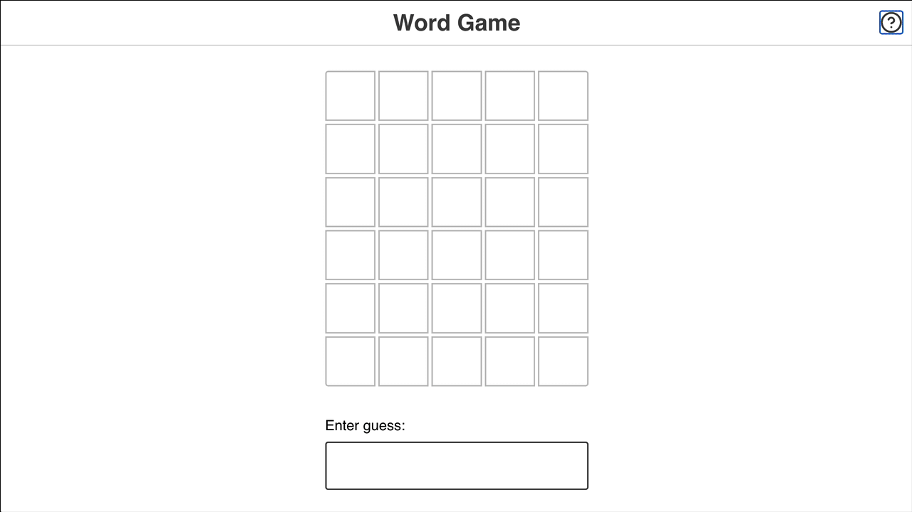
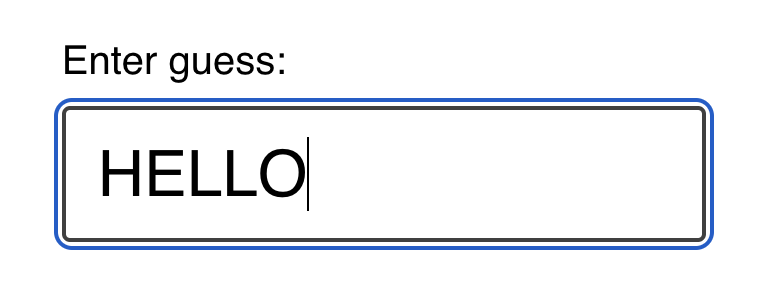
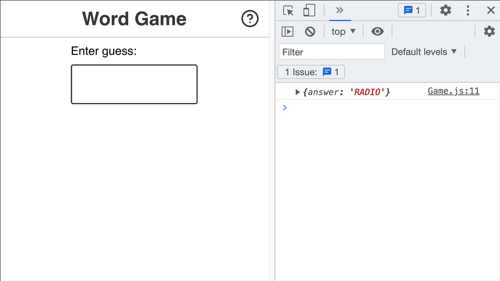
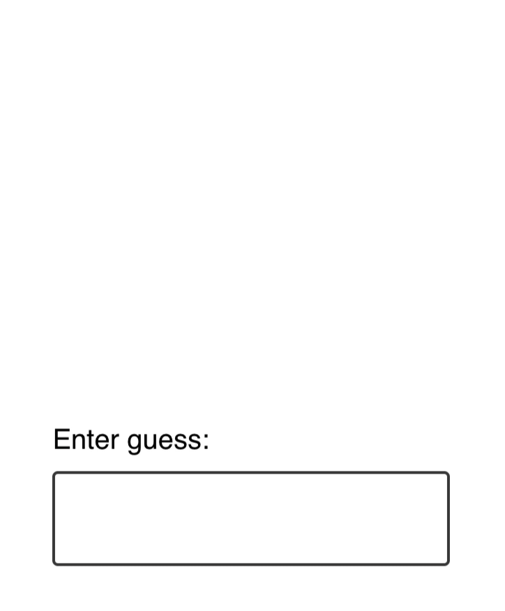
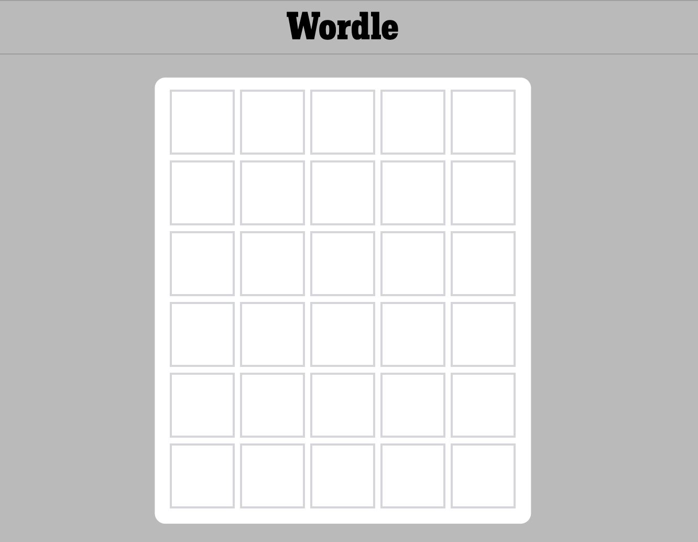
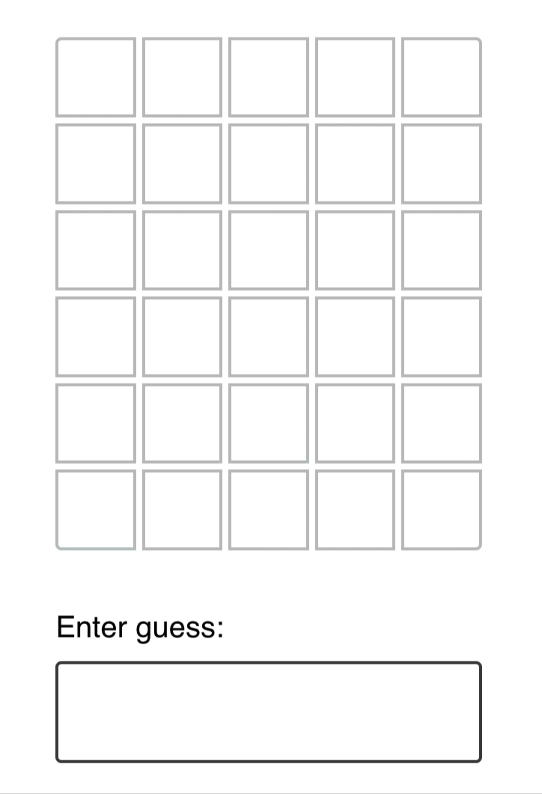
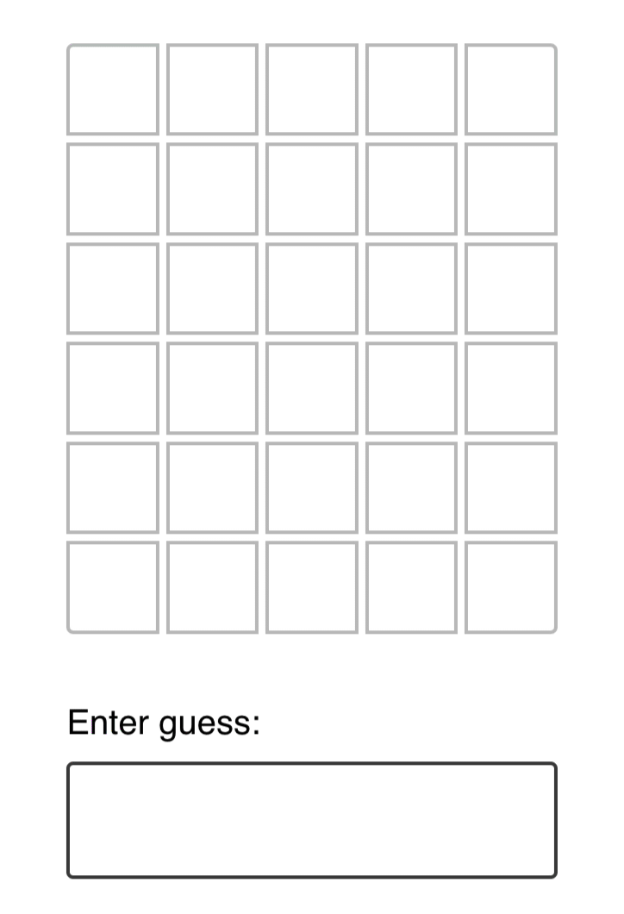
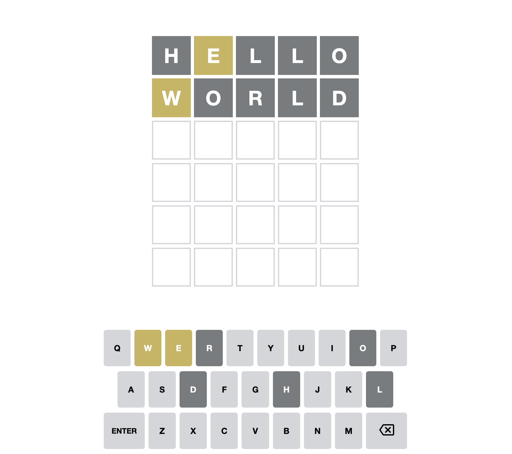

# Word Game

## Joy of React, Project I

In this project, we'll recreate a popular online word game, Wordle:



In Wordle, users have 6 attempts to guess a 5-letter word. You're helped along the way by ruling out letters that aren't in the word, and being told whether the correct letters are in the correct location or not.

## Getting Started

This project is created with [Parcel](https://parceljs.org/), a modern JS build tool. It's intended to be run locally, on your computer, using Node.js and NPM.

If you're not sure how to run a local development server, or if you run into some trouble, check out the [“Local Development” instructions](https://courses.joshwcomeau.com/joy-of-react/project-wordle/03-dev-server). It includes all the info you need to know, including troubleshooting common issues.

> **NOTE: This project is tricky!**
>
> This project is meant to be challenging, because I believe that the best way to learn is to be challenged. Depending on your experience level, though, you may feel like it's unreasonably difficult.
>
> This workshop is split into 5 exercises, and each exercise has a solution video. If you spend more than 10 minutes stuck on an exercise, I encourage you to **watch the solution.** If things are still unclear after that, please ask questions in the Discord community!

## Exercise 1: GuessInput

First thing’s first: we need a way to submit guesses!

In the standard Wordle game, a global event listener registers keypresses. This isn't very accessible, and so we're going to do things a little bit differently.

We'll render a little form that holds a text input:



Your job in this first exercise is to create a new component for this UI, and render it inside the `Game` component.

Here's a minimal representation of the markup expected to be produced by this new component:

```html
<form class="guess-input-wrapper">
  <label for="guess-input">Enter guess:</label>
  <input id="guess-input" type="text" />
</form>
```

**NOTE:** This is the _minimal_ markup required, for the styles to be applied and for accessibility. **It isn't set in stone!** Feel free to make tweaks in order to match all of the acceptance criteria below.

Here's a quick screen recording of the expected result:



**Acceptance Criteria:**

- Create a new component.
  - Don't forget, you can use an NPM script to generate the scaffolding for you! We learn how to do this in the [“Getting Started” video](https://courses.joshwcomeau.com/joy-of-react/project-wordle/04-overview)
- This component should render a `<form>` tag, including a label and a text input.
- The text input should be controlled by React state.
- When the form is submitted:
  - The entered value should be logged to the console (for now).
  - The input should be reset to an empty string.
- **The user's input should be converted to ALL UPPERCASE.** No lower-case letters allowed.
- The input should have a minimum and maximum length of 5.
  - **NOTE:** The `minLength` validator is a bit funky; you may wish to use the `pattern` attribute instead. This is discussed in more detail on the [Solution page](https://courses.joshwcomeau.com/joy-of-react/project-wordle/06-solution#an-alternative-to-minlength).

## Exercise 2: Keeping track of guesses

Instead of obliterating the user's guess, let's add it to a list, so we can show the user all of their previously-submitted guesses!

For now, we aren't worrying about any game-logic stuff. We're still setting up the scaffolding, getting some of the component + DOM structure in place.

Our goal in this exercise is to render each of the user's guesses:



And here's an example of the expected DOM structure:

```html
<div class="guess-results">
  <p class="guess">FIRST</p>
  <p class="guess">GUESS</p>
</div>
```

**Acceptance Criteria:**

- A new component should be created, to render previous guesses.
- When the user submits their guess, that value should be rendered within this new component.
- There should be no key warnings in the console!

## Exercise 3: Guess slots

In the real Wordle game, the initial screen shows 6 rows of 5 squares:



In this exercise, we'll update our code to display a similar grid. We'll show 6 rows of guesses, no matter how many guesses the user has submitted, and each row will consist of 5 cells.

As the user submits guesses, their guess will populate the cells:



Here's the DOM structure you'll want to create dynamically, based on the user's guesses:

```html
<div class="guess-results">
  <p class="guess">
    <span class="cell">H</span>
    <span class="cell">E</span>
    <span class="cell">L</span>
    <span class="cell">L</span>
    <span class="cell">O</span>
  </p>
  <p class="guess">
    <span class="cell">T</span>
    <span class="cell">H</span>
    <span class="cell">E</span>
    <span class="cell">R</span>
    <span class="cell">E</span>
  </p>
  <p class="guess">
    <span class="cell">W</span>
    <span class="cell">O</span>
    <span class="cell">R</span>
    <span class="cell">L</span>
    <span class="cell">D</span>
  </p>
  <p class="guess">
    <span class="cell"></span>
    <span class="cell"></span>
    <span class="cell"></span>
    <span class="cell"></span>
    <span class="cell"></span>
  </p>
  <p class="guess">
    <span class="cell"></span>
    <span class="cell"></span>
    <span class="cell"></span>
    <span class="cell"></span>
    <span class="cell"></span>
  </p>
</div>
```

**Things to know:**

There are two things that should help you tackle this exercise:

1. You can use the `range` utility to create arrays of a specified length to map over. It's provided in `/src/utils.js`. Check out the “Range Utility” lesson in the course for more info on how to use it.
2. Inside `/src/constants.js`, you'll find a constant, `NUM_OF_GUESSES_ALLOWED`. You should import and use this constant when generating the set of guesses. This would make it easy for us to change the difficulty of the game later on, by increasing/decreasing the # of guesses.

**Acceptance Criteria:**

- Create a new `Guess` component. 6 instances should be rendered at all times, no matter how many guesses have been submitted.
- The `Guess` component should render 5 spans, each with the class of `cell`.
- Each cell should contain a letter, if the `Guess` instance has been given a value. If not, the cell should be blank.
- Use the `NUM_OF_GUESSES_ALLOWED` constant, when needed.
- No `key` warnings in the console.

## Exercise 4: Game logic

Alright: over the first 3 exercises, we've been setting up all of the structure and scaffolding. It's time to do some game-logic stuff!

In this exercise, we'll add some CSS classes to color the background of each cell, based on the results and the correct answer:



Inside `/src/game-helpers.js`, you'll find a helper function, `checkGuess`. As parameters, it takes a single guess, as well as the correct answer. It returns an array that contains the status for each letter.

For example:

```js
checkGuess('WHALE', 'LEARN');
/*
  Returns:

  [
    { letter: 'W', status: 'incorrect' },
    { letter: 'H', status: 'incorrect' },
    { letter: 'A', status: 'correct' },
    { letter: 'L', status: 'misplaced' },
    { letter: 'E', status: 'misplaced' },
  ]
*/
```

There are 3 possible statuses:

- **correct** — this slot is perfect. It's the right letter in the right place.
- **misplaced** — this letter does exist in the word, but in a different slot.
- **incorrect** — this letter is not found in the word at all.

In the example above, `W` and `H` aren't found in the word `LEARN`, and so they're marked as “incorrect”. `A` is correct, since it's in the 3rd slot in each word. The other two letters, `L` and `E`, are meant to be in other slots.

**These statuses correspond with CSS classes.** The `correct` status has a `correct` class name, which will apply the green background when applied to a cell. Same thing for `misplaced` and `incorrect`.

Your task is to use this function to validate the user's guesses, and apply the correct CSS classes. The final output for a given guess should look like this:

```html
<p class="guess">
  <span class="cell incorrect">W</span>
  <span class="cell incorrect">H</span>
  <span class="cell correct">A</span>
  <span class="cell misplaced">L</span>
  <span class="cell misplaced">E</span>
</p>
```

**Acceptance Criteria:**

- Import the `checkGuess` function from `/src/game-helpers.js`, and use it to validate each of the user's guesses
- When rendering the letters in the `Guess` component, apply the letter's `status` to the `cell` element.
- "Empty" guess slots should have the same markup as before: `<span class="cell"></span>`.

## Exercise 5: winning and losing

We're so close! We only have one concern left: ending the game.

If the user wins the game, a happy banner should be shown:


If the user loses the game, by contrast, a sad banner should be shown:


The user wins the game when their guessed word is identical to the `answer`. They lose the game if they submit 6 guesses without winning.

```html
<div class="happy banner">
  <p>
    <strong>Congratulations!</strong> Got it in
    <strong>3 guesses</strong>.
  </p>
</div>
```

```html
<div class="sad banner">
  <p>Sorry, the correct answer is <strong>LEARN</strong>.</p>
</div>
```

When the game is over, one of these banners should be shown, and the text input should be disabled so that no new guesses can be typed or submitted.

**Acceptance Criteria:**

- If the user wins the game, a happy banner should be shown.
- If the user loses the game, a sad banner should be shown
- When the game is over, the text input should be disabled.
- It's up to you to decide how to structure the banner! Feel free to create new component(s) if you think it's warranted.

---

# Stretch Goals

If you're looking for an additional challenge, give these stretch goals a shot!

Unlike the standard exercises, no solution video is available for these goals, though the raw solution source code is available. See the solutions page on the Course Platform.

Also, feel free to come up with _your own_ stretch goals! If there's a thing you'd like to implement, go for it!!

## Visual Keyboard

In the real Wordle game, a keyboard is shown below the guesses:



This keyboard is an important game element, since it makes it easy to tell which letters have already been tested.

Here's what the keyboard looked like in my implementation:


**Note: Styling isn't provided for stretch goals.** You'll need to come up with your own CSS. You can add it to `src/styles.css`.

**Relatedly:** When you add a keyboard, it'll likely be pushed "below the fold" on smaller windows. Don't worry about trying to fit everything in the viewport at once.

**Acceptance Criteria:**

- Render 3 rows of letters at the bottom of the screen
- The colors of each letter should match the colors shown in the game board:
  - Correct letters should have a green background and white text
  - Misplaced letters should have a yellow background and white text
  - Incorrect letters should have a dark gray background and white text
  - Unused letters should have a light gray background and black text
- No need to include "Enter" and "Backspace" keys.
- Don't worry too much about the styling, trying to get the alignment to look exactly like a real keyboard.

## Restart button

One of Wordle's hooks is that you can only play 1 game per day: there's a new word for all users every day. As a result, there's no "restart button", you just have to wait until the next day.

In our clone, we aren't picking a new word every day, we're picking a new word when the app first loads.

Update the game so that it can be restarted. Add a "Restart game" button to the banner shown when the user wins or loses.

_HINT:_ This will require moving the `answer` into state. You'll want to do the random word selection inside a callback function, the secondary way to initialize state described here: https://courses.joshwcomeau.com/joy-of-react/02-state/03-use-state#initial-value

**Acceptance Criteria:**

- A "Restart Game" button is shown at the end of the game. You can put this button in the `GameOverBanner`, or wherever else you'd like!
- Clicking the button should select a new correct word and reset all other state.
